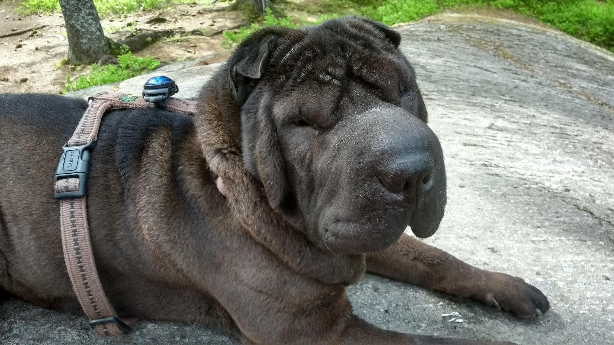
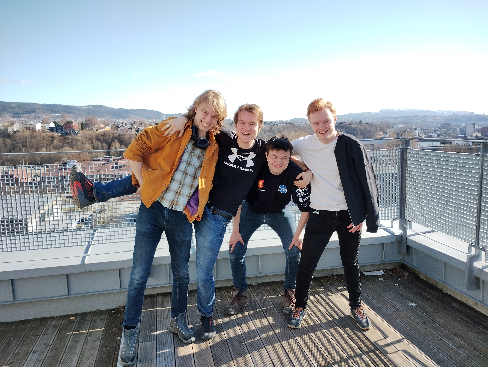
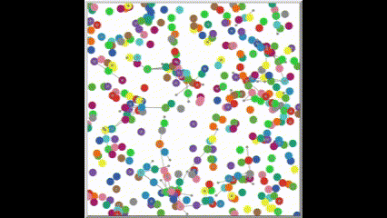

<h1> Skage Reistad   </h1> 

## About Me:

- **🚀 Positions:**
    - I am currently a software engineer working as a techincal assistant at **NTNU Department of Materials Science and Engineering** at a project in cooperation with the **Norwegian Public Roads Administration**.
    - Leader of LURDO! boardgame club
- **🏦 Education:**
    - I'm a student at **NTNU Trondheim** and **Natural Science with Teacher Education**, specializing in **IT and Math, Databases and Search-functions**.
- **💬 Let's Talk About:** 
    - Designing boardgames!
    - Anything related to machine-near operations!

<h2> 🧑‍💻 Good languages and technologies: </h2>

       
      
      
       
      
      
      
      
      
      

<h2> Good people I have worked with </h3>

- [Tobias Fremming](https://github.com/tobiasfremming) on [TutorAI](https://github.com/SverreNystad/TutorAI).
- [Sverre Nystad](https://github.com/SverreNystad) on [TutorAI](https://github.com/SverreNystad/TutorAI) and more.
- [Kristoffer Nohr Olaisen](https://github.com/Knolaisen) on  [TutorAI](https://github.com/SverreNystad/TutorAI).
- [Olav Selnes Lorentzen](https://github.com/olavsl) on [TutorAI](https://github.com/SverreNystad/TutorAI).
- [Ovi T.](https://github.com/Impelon) on the [BroadBubble](https://github.com/LockedInTheSkage/BroadBubble) project.

- And many more!

<!-- 
<h2>⚙️ GitHub Stats</h2>

  <picture>
    <source media="(prefers-color-scheme: dark)" srcset="https://github-readme-stats-nine-bay-97.vercel.app/api?username=lockedintheskage&show_icons=true&border_color=414868&theme=tokyonight"/>
    <source media="(prefers-color-scheme: light)" srcset="https://github-readme-stats-nine-bay-97.vercel.app/api?username=lockedintheskage&show_icons=true"/>
    
  </picture>
  <picture>
    <source media="(prefers-color-scheme: dark)" srcset="https://github-readme-stats-nine-bay-97.vercel.app/api/top-langs/?username=lockedintheskage&layout=compact&border_color=414868&theme=tokyonight"/>
    <source media="(prefers-color-scheme: light)" srcset="https://github-readme-stats-nine-bay-97.vercel.app/api/top-langs/?username=lockedintheskage&layout=compact">
    
  </picture>

-->

  
<strong>Projects I have worked on</strong>

   
  
  

<!-- Project 1: TutorAI -->
  <h3><a href="https://github.com/CogitoNTNU/TutorAI" width="200">TutorAI</a></h3>
  
 
  TutorAI is a RAG system capable of assisting with learning academic subjects and using the curriculum and citing it. The project revolves around building an application that ingests a textbook in most formats and facilitates efficient learning of the course material. 
  

   
  

  <h3><a href="https://github.com/LockedInTheSkage/BroadBubble" width="200">Broad Bubble</a></h3>
  
 
  Broadbubble is an extension of a social media simulation model designed to counteract the effects of isolation within social media environments. This concept is detailed in the paper titled "Broadening the Bubble: Technological Countermeasures to Isolation in an Agent-based Simulation of Social Media" written by me, Ovideu and some teammates.

  The model builds upon the foundational work described in "The triple filter bubble: Using agent-based modeling to test a meta-theoretical framework for the emergence of filter bubbles and echo chambers" by Daniel Geschke and his team.

 
  

   
  

  

